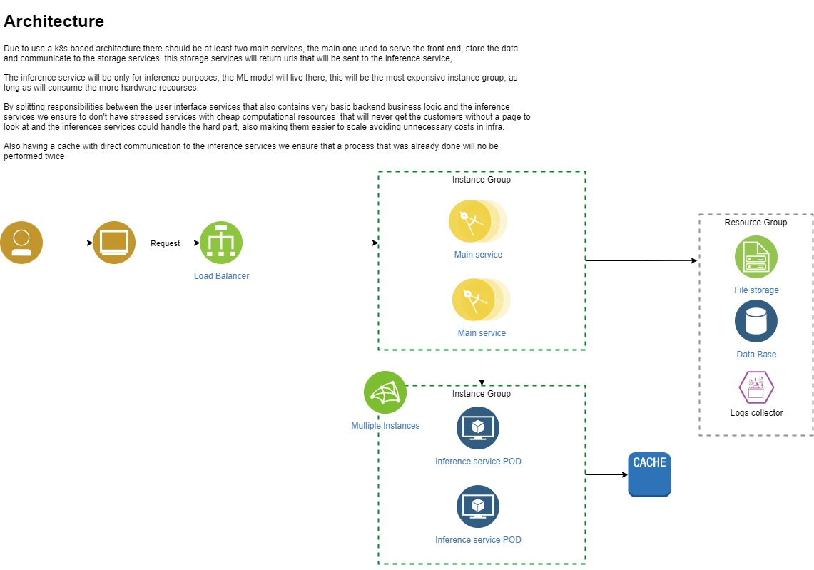

# ArtHeart.ai Technical test implementation process

David Santiago Fajardo Barrera <br>
Senior Machine Learning Engineer


# 1.  Create a virtual environment to work with
You can use the virtual env tool that fits you the most, In this case I'm using condaa

 ```bash
  conda create -n ArtHearDemo python=3.8
  conda activate ArtHearDemo
  ```

## 1.1 Once you are working in your environment install de requirements.txt


```python
!pip install requirements.txt
```

# 2. Clone the SadTalker github repo in your local machine


```python
!git clone https://github.com/OpenTalker/SadTalker.git
```

# 3. Set up the SalTaker code base, for this you could follow the installation instruccion posted in the repo's README <br>
In order to Simplify the process I also post the instructions in here <br>
This steps are simplified in order that you already created a virtual env and you working using it

### Linux:

1. Installing [anaconda](https://www.anaconda.com/), python and git.

2. Creating the env and install the requirements.
```bash
  cd SadTalker

  pip install torch==1.12.1+cu113 torchvision==0.13.1+cu113 torchaudio==0.12.1 --extra-index-url https://download.pytorch.org/whl/cu113

  conda install ffmpeg

  pip install -r requirements.txt

  ### tts is optional for gradio demo. 
  ### pip install TTS
```  

### Windows ([中文windows教程](https://www.bilibili.com/video/BV1Dc411W7V6/)):

1. Install [Python 3.10.6](https://www.python.org/downloads/windows/), checking "Add Python to PATH".
2. Install [git](https://git-scm.com/download/win) manually (OR `scoop install git` via [scoop](https://scoop.sh/)).
3. Install `ffmpeg`, following [this instruction](https://www.wikihow.com/Install-FFmpeg-on-Windows) (OR using `scoop install ffmpeg` via [scoop](https://scoop.sh/)).
4. Download our SadTalker repository, for example by running `git clone https://github.com/Winfredy/SadTalker.git`.
5. Download the `checkpoint` and `gfpgan` [below↓](https://github.com/Winfredy/SadTalker#-2-download-trained-models).
5. Run `start.bat` from Windows Explorer as normal, non-administrator, user, a gradio WebUI demo will be started.


### Macbook:

More tips about installation  on Macbook and the Docker file can be founded [here](docs/install.md)

# 4. Once you have all the base code setted up you must download the trained Models

## 📥 Download Trained Models.

You can run the following script to put all the models in the right place.

```bash
bash scripts/download_models.sh
```

Other alternatives:
> we also provide an offline patch (`gfpgan/`), thus, no model will be downloaded when generating.

**Google Driver**: download our pre-trained model from [ this link (main checkpoints)](https://drive.google.com/drive/folders/1Wd88VDoLhVzYsQ30_qDVluQr_Xm46yHT?usp=sharing) and [ gfpgan (offline patch)](https://drive.google.com/file/d/19AIBsmfcHW6BRJmeqSFlG5fL445Xmsyi?usp=sharing)

**Github Release Page**: download all the files from the [lastest github release page](https://github.com/Winfredy/SadTalker/releases), and then, put it in ./checkpoints.

**百度云盘**: we provided the downloaded model in [checkpoints,  提取码: sadt.](https://pan.baidu.com/s/1nXuVNd0exUl37ISwWqbFGA?pwd=sadt) And [gfpgan,  提取码: sadt.](https://pan.baidu.com/s/1kb1BCPaLOWX1JJb9Czbn6w?pwd=sadt)

## 4.1 In case you have some Issues by running the download_models.sh command

```bash
bash scripts/download_models.sh
```

If this commands fails to you due to any reason you can also download the models by hand:
1. Go to the releases [page](https://github.com/OpenTalker/SadTalker/releases)
2. Look for the assets and download all of them
3. Create a folder in your SalTalker folder and name it  **checkpoints**
4. Paste all yourdownloaded d assets inside the new **checkpoints** folder
5. The .zip files should be unzipped in the same folder
6. That's it! Now you can use the models and run the demo

# 5. Modify the app.py in the sadtalker repo in order to get an usable endpoint 

We will be using the gradio service as an API, to make it possible we need to enable the endpoint, don't be afraid it's quite easy.

1. Open the app.py in the gradio root folder using your favorite IDE or text editor
2. Go to line 131, here you can see the initialization for the 'on_click' or 'click' behavior that it's used in the submit button, you should look some code like this

```python
submit.click(
    fn=sad_talker.test,
    inputs=[source_image,
            driven_audio,
            preprocess_type,
            is_still_mode,
            enhancer],
    outputs=[gen_video]
    )
```
   
4. add the ```python api_name="predict"```  to the end of the initialization, after the outputs param (Don't forget the ',' comma), you should end with something like:

```python
submit.click(
    fn=sad_talker.test,
    inputs=[source_image,
            driven_audio,
            preprocess_type,
            is_still_mode,
            enhancer],
    outputs=[gen_video],
    api_name="predict"
    )
```

# 6. Run the app.py inside your sad talker folder

```python
python app.py
```

Run this command in a console with your environment activated this will create a new service listening using a gradio api that will be used in the front demo

# 7.Run the app.py in the DemoFront root folder

Once you have your gradio service running it's time to use the backend and front end interface to serve the model outputs.
For this you probably will need a new console with your virtual environment activated
```bash
  cd DemoFront

  python app.py
```
This will move you just in the DemoFront folder and after that will run a flask service that will be used as interface to serve the model outputs

# Three ways of how would you improve this?

1. No use the gradio backend API, instead create a full backend to serve the model output: Right now we have two services, one for the front and another one for the back, even the front service has a lot of improvement in terms of architecture it's enough in order to have all running. But having a full backed service that could be fully in charge of the model serving will give us more control about what we can do with the model output and the inputs we will be sended to the model, also can help us to think on the data infrastructure and architecture because right now we are just storing images and audio without any context.t2. have a database: with a database we can store the payloads sended to the model, also more information about users that could be used as a ladder for BI or stronger analysis in how to improve the product. 3. Use hugging face workspace to use the models from there: Right now we are using a model in the local machine, this model uses a gpu in case of having one available or the CPU this is very expensive, we can use a tool like hugging face to check for another models that actually do the same thing less expensive or use the workspace they provide as main computational hub for the inference endpointsce endpoints 

# Architecture Diagram




```python

```
